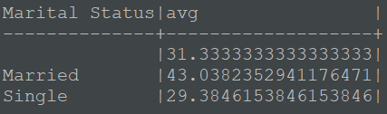

# Kalbe Nutritionals Data Scientist Project Based Internship Program
## Introduction
The VIX Data Scientist at Kalbe Nutritionals is a virtual internship experience facilitated by Rakamin Academy. 

**Objectives** <br>
1. Perform exploratory data analysis in DBeaver.
2. Create a dashboard in Tableau.
3. Predict the quantity of sales for the entire Kalbe product line.
4. Create customer clusters or segments based on various criteria.

**Dataset** <br>
[Kalbe Nutritionals sales dataset tahun 2022](https://drive.google.com/drive/folders/1_rQrauVW2OvLIe2zd54Vcwnr2EY-vnnR) <br>

**Tools** <br>
* Python <br>
* Jupyter Notebook <br>
* Tableau <br>
* Dbeaver <br>
* PostgreSQL <br>

## 1. Exploratory Data Analysis (EDA) in DBeaver
**What is the average age of customers based on their marital status?** <br>
<p align="center">

</p>

As we can see, the age for married individuals is 43, for single, it is 29, and the rest entries are null.

**What is the average age of customers based on their gender?** <br>
<p align="center"> 
 <br>
</p>

As we can see, the age for women (0) is 40, while for men (1) it is 39.

**What is the name of the store with the highest total quantity of products?** <br>
<p align="center"> 

</p>

As we can see, Lingga has the highest total quantity of products.

**What is the name of the best-selling product with the highest total amount?** <br>
<p align="center"> 

</p>

As we can see, cheese stick has the highest total amount.

## 2. Data Visualization

## 3. Time Series Forecasting
Aim to implement a machine learning model to accurately predict the number of sales (quantity) of the total Kalbe products.
### Data preparation
```Python
df = df_merged.groupby('Date').agg({'Qty':'sum'})
```
### Check stationarity
```Python
X = df['Qty'].values
result = adfuller(X)
print('ADF Statistic: %f' % result[0])
print('p-value: %f' % result[1])
print('Critical Values:')
for key, value in result[4].items():
	print('\t%s: %.3f' % (key, value))
```
p-value < 0.05, thus the data is stationary.
### Figure out order for ARIMA
```Python
auto_arima_model = pm.auto_arima(df['Qty'],
                                 seasonal=False,
                                 stepwise=False,
                                 trace=True,
                                 suppress_warnings=True)
auto_arima_model.summary()
```
Got Best model: ARIMA(1,0,1)
### Create training and testing datasets
```Python
train_size = int(len(df['Qty']) * 0.8)
train_data = df['Qty'][:train_size]
test_data = df['Qty'][train_size:]
print(train_data.shape,test_data.shape)
```
Visualize the differences:
```Python
plt.figure(figsize=(12,5))
sns.lineplot(data=train_data, x=train_data.index, y=train_data)
sns.lineplot(data=test_data, x=test_data.index, y=test_data)
plt.show()
```
<p align="center">
  
</p>

### Implement ARIMA
```Python
model = ARIMA(train_data, order=(1,0,1))
model = model.fit()
model.summary()
```
### Predict on test set
```Python
start = len(train_data)
end = len(train_data)+len(test_data)-1
pred = model.predict(start=start,end=end,typ='levels')
print(pred)
```
Check model accuracy:
```Python
rmse = sqrt(mean_squared_error(test_data,pred))
print(rmse)
```
output:
```bash
15.49482859020857
```
After the initial attempt, we got an error of 15.49%. Currently, we are working on enhancing the model through ARIMA grid search.

### Improvement: Grid search ARIMA
```Python
# Evaluate an ARIMA model for a given order (p, d, q)
def evaluate_arima_model(X, arima_order):
    # Prepare training dataset
    train_size = int(len(df['Qty']) * 0.8)
    train_data, test_data = df['Qty'][:train_size], df['Qty'][train_size:]
    history = [x for x in train_data]

    # Make predictions
    predictions = list()
    for t in range(len(test_data)):
        model = ARIMA(history, order=arima_order)
        model_fit = model.fit()
        yhat = model_fit.forecast()[0]
        predictions.append(yhat)
        history.append(test_data[t])

    # Calculate out-of-sample error
    rmse = sqrt(mean_squared_error(test_data, predictions))
    return rmse
```
```Python
# Evaluate combinations of p, d, and q values for an ARIMA model
def evaluate_models(dataset, p_values, d_values, q_values):
    dataset = dataset.astype('float32')
    best_score, best_cfg = float("inf"), None

    for p in p_values:
        for d in d_values:
            for q in q_values:
                order = (p, d, q)
                try:
                    rmse = evaluate_arima_model(dataset, order)
                    if rmse < best_score:
                        best_score, best_cfg = rmse, order
                    print('ARIMA%s RMSE=%.3f' % (order, rmse))
                except:
                    continue

    print('Best ARIMA%s RMSE=%.3f' % (best_cfg, best_score))

# Evaluate parameters
p_values = [6, 8, 10]
d_values = range(0, 3)
q_values = range(0, 3)

warnings.filterwarnings("ignore")
evaluate_models(df['Qty'].values, p_values, d_values, q_values)
```

```Python
rmse = sqrt(mean_squared_error(test_data,pred))
print(rmse)
```
Output:
```bash
Best ARIMA(10, 1, 1) RMSE=15.556
```
After testing various combinations of p, d, and q, we obtained the best ARIMA model. <br>

The order (10, 1, 1) resulted a slightly higher error when compared to the order (1, 0, 1). Therefore, we have opted for order (1, 0, 1) for our model.
|       Order          |       RMSE         |
| :------------------: | :----------------: |
|   (1,0,1)            |   15.49            |
|   (10,1,1)           |   15.55            |

### Forecast for all product
Forecast all product for the next 90 days:
```python
product_reg_df = df_merged[['Qty', 'Date', 'Product Name']]
new = product_reg_df.groupby("Product Name")

forecast_product_df = pd.DataFrame({'Date': pd.date_range(start='2023-01-01', periods=90)})

for product_name, group_data in new:
    target_var = group_data['Qty']
    model = ARIMA(target_var.values, order=(1,0,1))
    model_fit = model.fit()
    forecast = model_fit.forecast(90)
    forecast_product_df[product_name] = forecast

forecast_product_df.set_index('Date', inplace=True)
forecast_product_df.head()
```
Output:

| Date       | Cashew           | Cheese Stick    | Choco Bar     | Coffee Candy  | Crackers      | Ginger Candy  | Oat           | Potato Chip   | Thai Tea      | Yoghurt       |
| :--------- |:----------------:|:---------------:|:-------------:|:-------------:|:-------------:|:-------------:|--------------:|:-------------:|:-------------:|--------------:|
| 2023-01-01 | 2.643780         | 2.887033        | 5.719084      | 3.922062      | 3.536212      | 4.854919      | 1.989118      | 2.807238      | 3.472691      | 4.060748      |
| 2023-01-02 | 2.400617         | 2.916508        | 5.841903      | 3.982036      | 3.498383      | 4.931029      | 1.989644      | 2.803930	  | 3.521524      | 3.985260      |
| 2023-01-03 | 2.477836         | 2.935584        | 5.920862      | 4.004379      | 3.526270	  | 4.949085      | 1.989686      | 2.802217      | 3.496307      | 4.059759      |
| 2023-01-04 | 2.453314         | 2.947930        | 5.971625	  | 4.012703      | 3.505712      | 4.953368      | 1.989689      | 2.801329      | 3.509329      | 3.986237      |
| 2023-01-05 | 2.461101         | 2.955920        | 6.004260      | 4.015804      | 3.520867      | 4.954385      | 1.989690      | 2.800869      | 3.502604      | 4.058795      |

```Python
round(forecast_product_df.describe().T['mean'],0)
```
Output:
| Product Name | Quantity |
| ------------ | -------- |
| Cashew       | 2.0      |
| Cheese Stick | 3.0      |
| Choco Bar    | 6.0      |
| Coffee Candy | 4.0      |
| Crackers     | 4.0      |
| Ginger Candy | 5.0      |
| Oat          | 2.0      |
| Potato Chip  | 3.0      |
| Thai Tea     | 4.0      |
| Yoghurt      | 4.0      |
### Future Improvement
* Rolling forecast
* Other methods: Exponential Smoothing (ES), Simple ES
## 4. Customer Segmentation: Clustering
### Data preparation
```Python
df = df_merged.groupby('CustomerID').agg({'TransactionID':['count'],
                                          'Qty':['sum'],
                                          'TotalAmount':['sum']}).reset_index()
df.columns = ['CustomerID','TransactionID','Quantity','Total Amount']
df.head()
```
Feature slection for the model. Considering only 2 features (**Quantity and Total Amount**) Feature scaling:
```Python
X = df.iloc[:,[2,3]].values
```
```Python
# scaling using MinMaxScaler
scaler = MinMaxScaler()
scaler.fit(X)
scaled_data = scaler.fit_transform(X)
```
### Modelling
Finding the number of clusters using **elbow method**
```Python
K = range(1,12)
wss = []
for k in K:
    kmeans=KMeans(n_clusters=k,init="k-means++")
    kmeans=kmeans.fit(X)
    wss_iter = kmeans.inertia_
    wss.append(wss_iter)
```
We store the number of clusters along with their WSS Scores in a DataFrame:
```Python
mycenters = pd.DataFrame({'Clusters' : K, 'WSS' : wss})
mycenters
```
Visualize:
```Python
sns.lineplot(x = 'Clusters', y = 'WSS', data = mycenters, marker="o")
```
<p align="center">

</p>

From above we see that the optimum value of K for this generated data is 3, because for K = 3 and above the fluctuations in wcss is not happening much. <br>

Now here's comes the Silhouette. Let's use it to check out the best K value for our clustering algorithm:

```Python
range_n_clusters = [2, 3, 4, 5, 6]

for n_clusters in range_n_clusters:
    # Create a subplot with 1 row and 2 columns
    fig, (ax1, ax2) = plt.subplots(1, 2)
    fig.set_size_inches(18, 7)

    # The 1st subplot is the silhouette plot
    # The silhouette coefficient can range from -1, 1 but in this example all
    # lie within [-0.1, 1]
    ax1.set_xlim([-0.1, 1])
    # The (n_clusters+1)*10 is for inserting blank space between silhouette
    # plots of individual clusters, to demarcate them clearly.
    ax1.set_ylim([0, len(X) + (n_clusters + 1) * 10])

    # Initialize the clusterer with n_clusters value and a random generator
    # seed of 10 for reproducibility.
    clusterer = KMeans(n_clusters=n_clusters, n_init="auto", random_state=10)
    cluster_labels = clusterer.fit_predict(X)

    # The silhouette_score gives the average value for all the samples.
    # This gives a perspective into the density and separation of the formed
    # clusters
    silhouette_avg = silhouette_score(X, cluster_labels)
    print(
        "For n_clusters =",
        n_clusters,
        "The average silhouette_score is :",
        silhouette_avg,
    )

    # Compute the silhouette scores for each sample
    sample_silhouette_values = silhouette_samples(X, cluster_labels)

    y_lower = 10
    for i in range(n_clusters):
        # Aggregate the silhouette scores for samples belonging to
        # cluster i, and sort them
        ith_cluster_silhouette_values = sample_silhouette_values[cluster_labels == i]

        ith_cluster_silhouette_values.sort()

        size_cluster_i = ith_cluster_silhouette_values.shape[0]
        y_upper = y_lower + size_cluster_i

        color = cm.nipy_spectral(float(i) / n_clusters)
        ax1.fill_betweenx(
            np.arange(y_lower, y_upper),
            0,
            ith_cluster_silhouette_values,
            facecolor=color,
            edgecolor=color,
            alpha=0.7,
        )

        # Label the silhouette plots with their cluster numbers at the middle
        ax1.text(-0.05, y_lower + 0.5 * size_cluster_i, str(i))

        # Compute the new y_lower for next plot
        y_lower = y_upper + 10  # 10 for the 0 samples

    ax1.set_title("The silhouette plot for the various clusters.")
    ax1.set_xlabel("The silhouette coefficient values")
    ax1.set_ylabel("Cluster label")

    # The vertical line for average silhouette score of all the values
    ax1.axvline(x=silhouette_avg, color="red", linestyle="--")

    ax1.set_yticks([])  # Clear the yaxis labels / ticks
    ax1.set_xticks([-0.1, 0, 0.2, 0.4, 0.6, 0.8, 1])

    # 2nd Plot showing the actual clusters formed
    colors = cm.nipy_spectral(cluster_labels.astype(float) / n_clusters)
    ax2.scatter(
        X[:, 0], X[:, 1], marker=".", s=30, lw=0, alpha=0.7, c=colors, edgecolor="k"
    )

    # Labeling the clusters
    centers = clusterer.cluster_centers_
    # Draw white circles at cluster centers
    ax2.scatter(
        centers[:, 0],
        centers[:, 1],
        marker="o",
        c="white",
        alpha=1,
        s=200,
        edgecolor="k",
    )

    for i, c in enumerate(centers):
        ax2.scatter(c[0], c[1], marker="$%d$" % i, alpha=1, s=50, edgecolor="k")

    ax2.set_title("The visualization of the clustered data.")
    ax2.set_xlabel("Feature space for the 1st feature")
    ax2.set_ylabel("Feature space for the 2nd feature")

    plt.suptitle(
        "Silhouette analysis for KMeans clustering on sample data with n_clusters = %d"
        % n_clusters,
        fontsize=14,
        fontweight="bold",
    )
plt.show()
```
Output:
```bash
For n_clusters = 2 The average silhouette_score is : 0.5634481545384639
For n_clusters = 3 The average silhouette_score is : 0.5391208505196545
For n_clusters = 4 The average silhouette_score is : 0.5200001192732446
For n_clusters = 5 The average silhouette_score is : 0.5376406043497329
For n_clusters = 6 The average silhouette_score is : 0.5138904283581923
```


**Both elbow and silhouette score got different result**, but I **still choose elbow (K=3)** because the calculation simplicity of elbow makes it more suited than silhouette score for datasets with smaller size or time complexity.

### Applying cluster K=3
```Python
# Fitting K-Means to the dataset
kmeans = KMeans(n_clusters = 3, init = 'k-means++', random_state = 42)
y_kmeans = kmeans.fit_predict(X)

#Visualizing all the clusters
plt.scatter(X[y_kmeans == 0, 0], X[y_kmeans == 0, 1], s = 100, c = 'red', label = 'Cluster 0')
plt.scatter(X[y_kmeans == 1, 0], X[y_kmeans == 1, 1], s = 100, c = 'blue', label = 'Cluster 1')
plt.scatter(X[y_kmeans == 2, 0], X[y_kmeans == 2, 1], s = 100, c = 'green', label = 'Cluster 2')
plt.scatter(kmeans.cluster_centers_[:, 0], kmeans.cluster_centers_[:, 1], s = 300, c = 'yellow', label = 'Centroids')

plt.title('Segmentasi Pelanggan berdasarkan Quantity dan Total Amountnya')
plt.xlabel('Quantity')
plt.ylabel('Total Amount')
plt.legend()
plt.show()
```
<p align="center">

</p>

```Python
# Convert the NumPy array into a DataFrame
new_data = pd.DataFrame(y_kmeans, columns=['Cluster'])

# Concatenate the new DataFrame with the existing DataFrame
combined_df = pd.concat([df, new_data], axis=1)

combined_df.head()
```
Output:
| CustomerID | TransactionID | Quantity | Total Amount | Cluster  | 
|----------- |-------------- |----------|------------- |----------|
|      1     |     17        |   60     |     623300   |    2     |          
|      2     |     13        |   57     |     392300   |    0     |          
|      3     |     15        |   56     |     446200   |    0     |          
|      4     |     10        |   46     |     30250    |    1     |          
|      5     |      7        |   27     |     268600   |    1     |   
